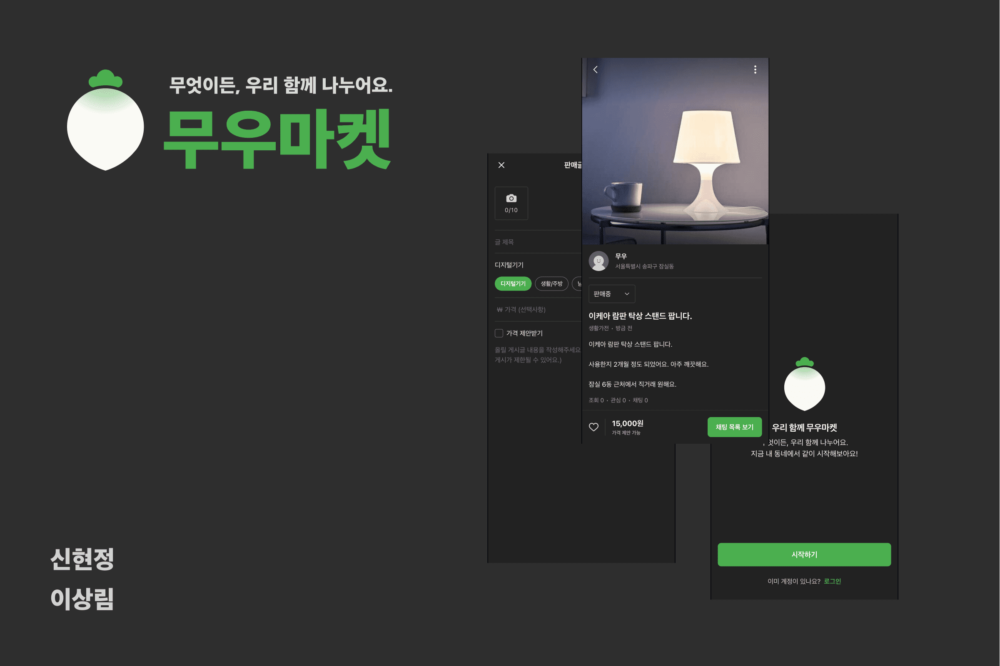
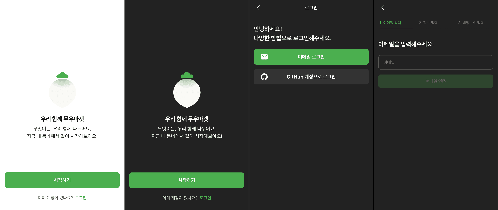
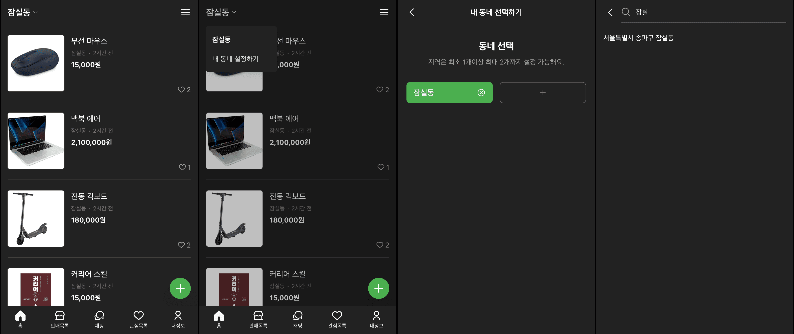
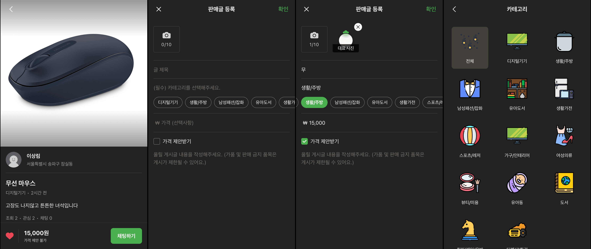

# 무우마켓 중고 거래 서비스

같은 동네 사용자와 중고거래를 위한 서비스를 제공하는 모바일 웹 서비스.

\* 서버 사용 기간 종료로 인해 서비스가 배포되어있지 않은 상태입니다

## 기술 스택

Frontend

Backend

## 구현 기능

### 시작 페이지

**✦ 로그인 및 회원가입**

'이메일로' 또는 'Github로' 로그인 및 회원가입이 가능합니다.

**✦ 라이트모드 / 다크모드 테마**

유저 OS 단에 설정된 테마에 따라 적용됩니다.

- styled-components의 ThemeContext을 통해 컴포넌트에 테마 적용 ([코드보기](https://github.com/Hyeondoonge/web-fleemarket-05/blob/dev/client/src/App.tsx))

### 메인 페이지

**✦ 동네 물품 목록 조회**

동일한 동네 유저들이 등록한 물품들을 조회합니다.

- 드롭다운 메뉴 선택을 통해 조회 동네 설정
- 무한 스크롤 적용 ([코드보기](https://github.com/Hyeondoonge/web-fleemarket-05/blob/dev/client/src/hooks/useInfinityScroll.ts))

**✦ 최대 2개의 유저 동네 설정**

동네 선택을 통해 현재 동네를 추가하거나 제거합니다.

- LocalStorage에 저장된 선택된 동네를 전역 상태로 관리 ([코드보기](https://github.com/Hyeondoonge/web-fleemarket-05/blob/dev/client/src/recoil/atoms/region.atom.ts))

**✦ 동네 검색 기능**

검색 결과를 클릭해 새로운 동네를 추가합니다.

- 무한 스크롤 적용
- debounce 적용

### 판매 글 페이지

**✦ 상품 CRUD**

유저의 상품을 관리합니다.

- ErrorBoundary로 상품 삭제에 대한 에러 핸들링
([코드보기](https://github.com/Hyeondoonge/web-fleemarket-05/blob/dev/client/src/pages/EditArticlePage.tsx))

- scroll snap api를 통한 이미지 슬라이드 구현 ([코드보기](https://github.com/Hyeondoonge/web-fleemarket-05/blob/dev/client/src/components/article/Article/ArticleCarousel/ArticleCarousel.styled.ts))

**✦ 카테고리 설정**

카테고리 선택을 통해 조회 대상을 구체화합니다.

- Suspense + Skelton UI로 로딩핸들링 ([코드보기](https://github.com/Hyeondoonge/web-fleemarket-05/blob/dev/client/src/layouts/CategorySelectLayout/CategorySelectLayout.tsx))
